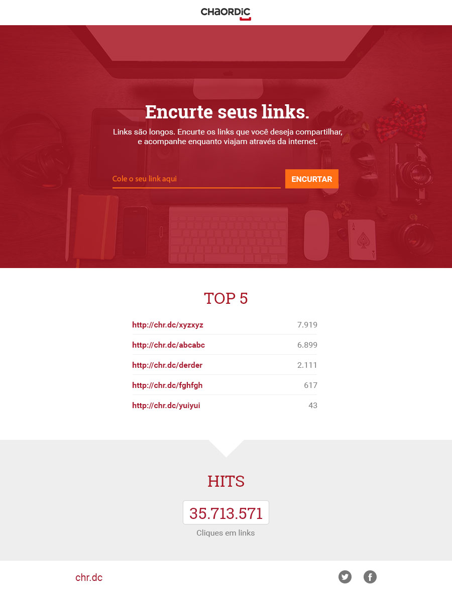

> This project was developed by me while I learn and practice new technologies and it is based on a real job challenge from a real company. 
> **Companny:** [`Chaordic`](https://www.chaordic.com.br/) 
> **Original challenge description:** [`link`](https://github.com/chaordic/frontend-intern-challenge) 
> **My response:**
&nbsp;
[**`Run App/Demo`**](https://blog.andersonmamede.com.br/challenge-url-shortener/app/build/)
&nbsp;
[**`Source Code`**](https://github.com/AndersonMamede/challenge-url-shortener/tree/master/app)
> **Main project:** [**`challenges-accepted`**](https://github.com/AndersonMamede/challenges-accepted)

## Challenge: URL shortener

***Stack**: React* 

The challenge is to create a SPA (Single Page Application) to simulate an URL shortener application. Your main goal is to convert this layout into a functional prototype:

### Instructions

- Use this [color guideline](layout-color-guideline.jpg)
- You must implement [this animation](layout-interaction.gif)
- Other images are available in [assets folder](assets)
- Use this [mock data](mock-data.json) for **TOP 5** section
- Fonts are [Roboto](https://www.google.com/fonts/specimen/Roboto) and [Roboto Slab](https://www.google.com/fonts/specimen/Roboto+Slab)
- You can use CSS preprocessors like [Sass](http://sass-lang.com), [Less](http://lesscss.org) and [Stylus](http://stylus-lang.com)
- Application must work in all devices
